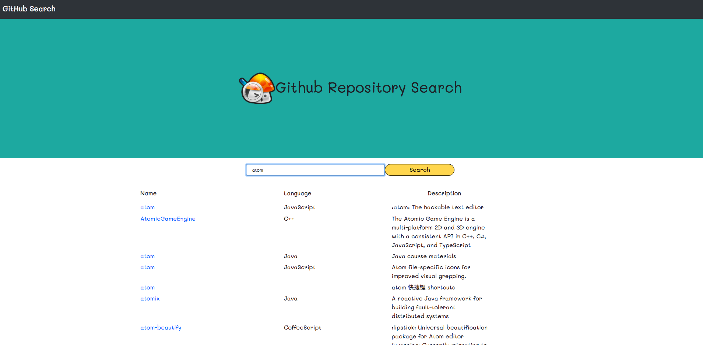

# GitHub Repositories Search App

# Introduction

This web app will allow the user to search GitHub repositories using the GitHub Search API.



# Getting Started
**To get the development environment running simply follow these steps on your command line**:

```
npm install
```
```
npm start
```

## Built with:
  * [create-react-app](https://github.com/facebook/create-react-app?files=1)
  * [Axios Promise based HTTP client](https://github.com/axios/axios)
  * [Github API V3](https://developer.github.com/v3/search/)
  * [Bootstrap 4](http://getbootstrap.com/)

## Authors
* **Jo Malo**

## Sources of help
Big thanks to ziad-saab in particular for guidance via the [react-github-api-project](https://github.com/ziad-saab/react-github-api-project).
